# OpenConnect

OpenConnect is a native macOS app that replaces the **microphone-control half** of RØDE Connect — independent channel strips, a software mixer, and a virtual input device that Teams, Zoom, OBS and any other app can select.

**What it is not.** There is no recording, no soundboard, no podcast/multitrack output, and no headphone monitoring. If you need those, use RØDE Connect. OpenConnect exists because the mic-control part of RØDE Connect can glitch badly when two USB mics run simultaneously; OpenConnect solves the clock-drift problem properly.

**Reference hardware.** A RØDE NT-USB Mini and a RØDE VideoMic NTG in USB mode used simultaneously as two independent channels. Any USB audio interface that CoreAudio can see will work.

---

## Contents

- [Requirements](#requirements)
- [Install](#install)
- [Using it](#using-it)
- [Architecture](#architecture)
- [Building and testing](#building-and-testing)
- [Releasing](#releasing)
- [Troubleshooting](#troubleshooting)
- [Status and roadmap](#status-and-roadmap)

---

## Requirements

| | |
|---|---|
| **macOS** | 13.0 or later (Ventura+) |
| **Architecture** | Apple Silicon (arm64) and Intel (x86_64); universal binary |
| **Signing** | A valid **Developer ID Application** certificate. macOS will not load an AudioServerPlugIn bundle unless it is signed with a Developer ID — ad-hoc signing is rejected by the HAL. |
| **Build tools** | Xcode command-line tools (`xcode-select --install`), Swift 6 toolchain (for `make test`) |

---

## Install

### Release install (recommended)

Download the latest release from the GitHub Releases page. It ships two artifacts:

- **`OpenConnect-macos.dmg`** — drag-to-Applications installer for the app.
- **`OpenConnect-driver.pkg`** — standalone installer for the CoreAudio HAL plug-in (`OpenConnect.driver`). Run this first; it places the driver at `/Library/Audio/Plug-Ins/HAL/OpenConnect.driver`.

**Important:** the `.pkg` installer does *not* restart CoreAudio. After installing the driver, either reboot or run:

```bash
sudo killall -9 coreaudiod
```

This briefly interrupts **all system audio** (speakers, headphones, every audio app). A reboot is the only officially supported reload; `launchctl kickstart -k system/com.apple.audio.coreaudiod` was deprecated in macOS 14.4.

### Dev install (from source)

```bash
# Build the driver and install it to /Library/Audio/Plug-Ins/HAL/
make install-driver
```

`make install-driver` calls `scripts/install_driver_dev.sh`, which:
1. Runs `make driver` to compile the driver bundle.
2. Signs it with your Developer ID Application identity (auto-detected from Keychain, or set `CODE_SIGN_IDENTITY` in `.release.env`).
3. Copies it to `/Library/Audio/Plug-Ins/HAL/OpenConnect.driver` with `sudo`.
4. Runs `sudo killall -9 coreaudiod` to reload CoreAudio.
5. Polls `system_profiler` for up to 10 seconds to confirm "OpenConnect Mic" appears.

```bash
# Remove the driver
make uninstall-driver
```

> **First time installing?** Follow **[docs/PHASE1-VERIFICATION.md](docs/PHASE1-VERIFICATION.md)**
> instead of these commands alone. It is a step-by-step runbook for the end-to-end hardware test —
> what to check at each stage, how to tell a real failure from expected behaviour, and a guaranteed
> rollback if anything goes wrong. Note that `sudo killall -9 coreaudiod` briefly interrupts audio
> for **every** application on the system, so leave any call or recording first.

---

## Using it

1. Install the driver as above. **"OpenConnect Mic"** will appear in **System Settings → Sound → Input**.
2. In Teams, Zoom, OBS, or any other app, set the input device to **OpenConnect Mic**.
3. Launch **OpenConnect.app**. The app detects all connected input devices and gives each a channel strip.
4. Per-channel controls:

   | Control | Notes |
   |---|---|
   | **Pad** | Fixed attenuation (default −20 dB), enable/disable |
   | **Gain** | Pre-DSP trim |
   | **High-Pass Filter** | Off / 75 Hz / 150 Hz / Variable (continuous frequency) |
   | **Noise Gate** | Threshold, attack, hold, release, hysteresis |
   | **Compressor** | Threshold, ratio, attack, release, makeup gain, knee (RMS detector) |
   | **Aural Exciter** | Amount, frequency, drive |
   | **Big Bottom** | Amount, frequency, drive |
   | **Fader** | Post-DSP level, ramped per block so moves are inaudible as steps |
   | **Mute / Solo** | Solo is cross-channel; soloing one mic silences all others |

5. Settings are **persisted per device UID**. Unplug a mic and plug it back in — its strip remembers every parameter.

---

## Architecture

### Why not an aggregate device?

macOS aggregate devices (the mechanism RØDE Connect likely uses) put the drift correction inside `coreaudiod`. Apple's implementation is conservative and often produces audible artefacts when two USB microphones diverge significantly. OpenConnect owns the correction loop entirely, which is why it can tune it for inaudibility.

### The mirror-device design

The HAL plug-in (`OpenConnect.driver`) publishes two CoreAudio devices backed by a single shared ring buffer in the plug-in's process memory:

| Device | Visibility | Direction | Purpose |
|---|---|---|---|
| **OpenConnect Mic** | Visible | Input | What Teams/Zoom/OBS select |
| **OpenConnect Sink** | Hidden | Output | What OpenConnect.app renders into |

The sink is hidden specifically to prevent users selecting it as speakers, which would create a feedback loop. Both devices derive their position in the ring from `mach_absolute_time()` modulo the ring length (16 384 frames), so they share a clock with no pointer handshake between them.

The ring buffer is entirely inside the driver process. The app renders audio into the sink via a standard AUHAL output unit; the mic device reads back out of the same memory. There is **no IPC** between the app and the driver.

### Why the driver is dumb

Every line of code in `coreaudiod` is a liability: a fault there takes down audio for the entire machine. The driver therefore contains no DSP, no dependencies, and no Swift/ObjC runtime. It is a C11 bundle, compiled with `-Wall -Wextra -Werror`, that does nothing but maintain the ring and answer HAL property queries. All signal processing lives in the app, which can crash safely.

### Signal path

```mermaid
flowchart LR
    subgraph hw [Hardware]
        MicA[USB Mic A]
        MicB[USB Mic B]
    end

    subgraph app [OpenConnect.app  — render thread]
        RA[AUHAL input\nMic A clock]
        RB[AUHAL input\nMic B clock]
        RingA[SPSC ring A\n32 768 frames]
        RingB[SPSC ring B\n32 768 frames]
        Drift[Drift controller\n+ fractional resampler]
        DSPA[DSP strip A\nPad·Gain·HPF·Gate·Comp·Exciter·Bottom]
        DSPB[DSP strip B\nPad·Gain·HPF·Gate·Comp·Exciter·Bottom]
        Mix[Stereo mix\nfader + mute/solo]
        Out[AUHAL output\nmaster clock  48 kHz]
    end

    subgraph driver [OpenConnect.driver — coreaudiod]
        Sink[OpenConnect Sink\nhidden output]
        HalRing[HAL ring buffer\n16 384 frames]
        Mic[OpenConnect Mic\nvisible input]
    end

    subgraph clients [Audio clients]
        Zoom[Zoom / Teams / OBS]
    end

    MicA --> RA --> RingA
    MicB --> RB --> RingB
    RingA --> Drift --> DSPA --> Mix
    RingB --> Drift --> DSPB --> Mix
    Mix --> Out --> Sink --> HalRing --> Mic --> Zoom
```



### Clock drift correction

Each USB microphone runs on its own crystal oscillator, which is not synchronised to the output device. Over time the mic clock drifts relative to the output clock: a mic running 50 ppm fast will overfill the ring at about 2.4 frames per minute.

OpenConnect makes the **AUHAL output callback the master clock**. Every render callback:

1. Reads the current fill level of each channel's SPSC ring.
2. Feeds the fill error (actual − target, where target is 1 536 frames) into a **PI controller**.
3. Multiplies the nominal rate ratio by the correction factor and passes it to a **fractional resampler**.
4. Pulls exactly the requested number of frames from the resampler into the DSP chain.

The PI gains (`kp = 2e-7`, `ki = 4e-9`) are deliberately gentle: the correction stays in the parts-per-million range and is completely inaudible. An integrator clamp (±5e-4), a ratio clamp (±1e-3 from 1.0), and a slew limit (2e-6 per update) prevent any transient from producing an audible step.

### Realtime safety

The render callback path (everything reachable from `ocOutputRenderCallback` and `ocInputRenderCallback`) enforces:

- **No allocation.** All storage is pre-allocated at engine start and freed at stop.
- **No locks.** The ring buffer and parameter queue are lock-free SPSC structures.
- **No logging.** No `os_log`, `NSLog`, `print`, or Swift string interpolation.
- **No Swift/ObjC runtime traffic.** All render-path types are C-layout structs accessed through raw pointers; no ARC, no bridging.

The UI communicates with the render thread exclusively through a **lock-free parameter queue** (`oc_param_queue`). Parameter IDs pack the channel index into the high 16 bits and the parameter selector into the low 16 bits, so a single atomic pop gives the render thread everything it needs.

### Repository layout

```
OpenConnect/
├── App/
│   ├── OpenConnectDriver/          CoreAudio AudioServerPlugIn (C11)
│   │   ├── OpenConnectDriver.c     Driver implementation — HAL ring loopback
│   │   └── Info.plist              CFPlugIn registration (kAudioServerPlugInTypeUUID)
│   └── OpenConnectApp/
│       ├── App/                    SwiftUI app entry point
│       ├── Audio/
│       │   ├── AudioDeviceManager.swift    Hot-plug enumeration, sink discovery
│       │   ├── AudioEngine.swift           AUHAL graph, device binding, lifecycle
│       │   └── AudioEngineRT.swift         Render callbacks, drift control, preallocated state
│       ├── Control/
│       │   └── ParameterStore.swift        UI↔render transport, persistence, solo logic
│       ├── Models/
│       │   └── ChannelSettings.swift       Per-channel settings model (Codable)
│       ├── Persistence/
│       │   └── SettingsStore.swift         JSON persistence keyed by device UID
│       ├── Views/                          SwiftUI channel strip and mixer views
│       └── Hardware/                       USB HID stubs (reserved for v2)
├── Core/
│   └── Sources/OpenConnectDSP/     C++17 DSP core behind a pure C ABI
│       ├── include/OpenConnectDSP/ Public headers (consumed by app via bridging header)
│       ├── oc_channel_strip.cpp    Full processing chain per channel
│       ├── oc_biquad.cpp           Second-order IIR (HPF implementation)
│       ├── oc_gate.cpp             Noise gate
│       ├── oc_compressor.cpp       Feed-forward compressor (RMS detector)
│       ├── oc_exciter.cpp          Aural exciter
│       ├── oc_big_bottom.cpp       Big Bottom bass enhancer
│       ├── oc_resampler.cpp        Fractional resampler (linear interpolation)
│       ├── oc_drift_controller.cpp PI controller with anti-windup + slew limiter
│       ├── oc_ring_buffer.cpp      Lock-free SPSC ring (power-of-two, sample-indexed)
│       ├── oc_param_queue.cpp      Lock-free SPSC parameter queue
│       ├── oc_meter.cpp            Peak + RMS level metering
│       └── oc_smoothed_param.cpp   Per-sample parameter smoothing
├── scripts/
│   ├── build_release.sh            Clean, universal build, codesign app + driver
│   ├── install_driver_dev.sh       Dev install: build → sign → sudo install → reload
│   ├── uninstall_driver.sh         sudo remove + reload
│   ├── make_pkg.sh                 Flat package installer for driver only
│   ├── make_dmg.sh                 DMG containing app + driver .pkg
│   ├── notarize_pkg.sh             notarytool submit + staple (PKG)
│   ├── notarize_dmg.sh             notarytool submit + staple (DMG)
│   └── release_macos.sh            One-shot: build → pkg → dmg → notarize both
├── Makefile
└── .release.env.example
```

---

## Building and testing

### Prerequisites

```bash
xcode-select --install   # Xcode command-line tools
```

The C/C++ driver and DSP core are compiled by `clang`/`clang++` (bundled with Xcode). The app is compiled by `swiftc`. The test suite uses the Swift Package Manager toolchain.

### Make targets

| Target | What it does |
|---|---|
| `make` / `make all` | Build driver bundle + app (native arch) |
| `make driver` | Build `dist/OpenConnect.driver` only |
| `make build` | Build `dist/OpenConnect.app` (native arch; DSP core compiled first) |
| `make build UNIVERSAL=1` | Build universal (arm64 + x86\_64) app |
| `make embed-driver` | Copy driver bundle into `OpenConnect.app/Contents/Library/Audio/Plug-Ins/HAL/` |
| `make embed-driver UNIVERSAL=1` | Universal build + embed driver |
| `make test` | Run the DSP core test suite via `swift test` |
| `make run` | Build + launch `OpenConnect.app` |
| `make install-driver` | Build, sign, sudo-install driver, restart CoreAudio |
| `make uninstall-driver` | sudo-remove driver, restart CoreAudio |
| `make clean` | Remove `dist/` and `Core/.build/` |

> **Dev vs. release builds.** `make build` compiles only the native architecture for speed. Pass `UNIVERSAL=1` to produce the arm64+x86\_64 lipo'd binary that goes into a release. `swiftc`, unlike `clang`, cannot emit a fat binary in one pass; the Makefile compiles each slice separately and calls `lipo`.

### DSP test suite

```bash
make test
# or
cd Core && swift test
```

The test suite (`Core/Tests/OpenConnectDSPTests/`) tests every module in `Core/Sources/OpenConnectDSP/` through its C ABI. Tests include:

- Biquad HPF: −3 dB at 75 Hz and 150 Hz cutoffs, unity passband, >10 dB roll-off one octave below cutoff, numerical stability on 10 s of white noise.
- Smoothed parameter: bounded per-sample delta, convergence, settled state.
- Noise gate, compressor, exciter, Big Bottom, ring buffer, resampler, drift controller (see the test file for the full list).

> **Note:** the test target `Platform` constraint in `Core/Package.swift` is `.macOS(.v14)`, so `make test` requires macOS 14 Sonoma or later.

### CI

Every push and pull request runs two jobs (`.github/workflows/ci.yml`):

| Job | What it checks |
|---|---|
| `core` (Swift package) | `swift build` + `swift test` for the DSP core |
| `build` (driver and app) | `make driver`, `make build UNIVERSAL=1`, `make embed-driver UNIVERSAL=1` |

Signing secrets are not present in CI, so the driver and app are built unsigned. This is sufficient to catch compile breaks.

---

## Releasing

The release workflow (`.github/workflows/release.yml`) triggers on a `v*` tag push or manual `workflow_dispatch`.

It produces:

| Artifact | Contents |
|---|---|
| `OpenConnect-macos.dmg` | Signed + notarized DMG: `OpenConnect.app` + `OpenConnect-driver.pkg` |
| `OpenConnect-driver.pkg` | Signed + notarized flat package installing the driver to `/Library/Audio/Plug-Ins/HAL/` |
| `*.sha256` | SHA-256 checksums |

Both artifacts are attached to the GitHub Release and uploaded as workflow artifacts.

### Local release build

```bash
cp .release.env.example .release.env
# Edit .release.env: set CODE_SIGN_IDENTITY (and optionally NOTARY_PROFILE)
./scripts/release_macos.sh
```

`release_macos.sh` calls `build_release.sh` → `make_pkg.sh` → `notarize_pkg.sh` → `make_dmg.sh` → `notarize_dmg.sh` in sequence.

### Required environment variables

| Variable | Required for | Description |
|---|---|---|
| `CODE_SIGN_IDENTITY` | Signing | Full `Developer ID Application: Name (TEAMID)` string. Auto-detected from Keychain if unset. |
| `TEAM_ID` | Informational | Apple Team ID (10-character string). |
| `NOTARY_PROFILE` | Notarization | Keychain profile name stored by `xcrun notarytool store-credentials`. Preferred over bare credentials. |
| `APPLE_ID` | Notarization | Apple ID email, used if `NOTARY_PROFILE` is not set. |
| `APPLE_TEAM_ID` | Notarization | Same as `TEAM_ID`; used alongside `APPLE_ID`. |
| `APPLE_APP_PASSWORD` | Notarization | App-specific password generated at appleid.apple.com. |
| `INSTALLER_SIGN_IDENTITY` | PKG signing | `Developer ID Installer: Name (TEAMID)` string. Auto-detected from Keychain if unset. |

Notarization is skipped automatically when neither `NOTARY_PROFILE` nor the three bare-credential variables are set. This means CI builds without secrets produce unsigned, unnotarized artifacts.

### CI secrets (GitHub Actions)

| Secret | Purpose |
|---|---|
| `MACOS_CERTIFICATE` | Base64-encoded `.p12` Developer ID certificate |
| `MACOS_CERTIFICATE_PWD` | Password for the `.p12` |
| `APPLE_ID` | Apple ID for notarization |
| `APPLE_TEAM_ID` | Apple Team ID |
| `APPLE_APP_PASSWORD` | App-specific password |

---

## Troubleshooting

### "OpenConnect Mic" does not appear in System Settings → Sound → Input

1. **Confirm the driver is installed.**
   ```bash
   ls /Library/Audio/Plug-Ins/HAL/OpenConnect.driver
   ```
   If missing, run `make install-driver`.

2. **Verify the signature.**
   ```bash
   codesign --verify --strict --verbose=2 /Library/Audio/Plug-Ins/HAL/OpenConnect.driver
   spctl --assess --type execute /Library/Audio/Plug-Ins/HAL/OpenConnect.driver
   ```
   An unsigned or ad-hoc-signed driver will be silently rejected by the HAL. A valid Developer ID signature is required.

3. **Check Console.app for load errors.**
   Open Console.app, filter by process `coreaudiod`, and look for lines mentioning `OpenConnect` or `audio.openconnect.driver`. Common failures: signature validation error, bundle format error, or a crash inside the plug-in.

4. **Restart CoreAudio.**
   ```bash
   sudo killall -9 coreaudiod
   ```
   This is an unsupported-but-common trick. It briefly interrupts all system audio. `launchctl kickstart -k system/com.apple.audio.coreaudiod` was deprecated in macOS 14.4.

5. **Reboot.**
   A reboot is the only officially supported way to force the HAL to pick up a new plug-in. If the device still does not appear after a reboot, the issue is almost certainly the driver signature.

### OpenConnect.app launches but shows no channels

The app can run without the driver installed. It will enumerate hardware input devices and let you configure them, but there is nowhere to send the mix. The status indicator in the app will reflect that the sink device is unavailable. Install the driver (see above) and the output path will connect automatically — no restart of the app required.

### All system audio cuts out briefly

Expected: this happens whenever `coreaudiod` is restarted. It recovers in one to two seconds. Zoom and Teams will notice the gap and may briefly show a warning.

### Microphone permissions

macOS requires explicit microphone permission for any app that captures audio. On first launch OpenConnect will prompt for permission. If you denied it, grant it in **System Settings → Privacy & Security → Microphone**.

---

## Status and roadmap

### What is verified

- The HAL plug-in compiles clean and signs with a Developer ID certificate.
- The DSP core passes its full test suite (`make test`).
- The app builds as a universal binary (arm64 + x86_64) and launches on macOS 13+.

### What is **not** yet verified

> **The plug-in has not yet been loaded by `coreaudiod` in testing, and no audio has passed through the complete pipeline with real hardware.** The ring-buffer loopback design, the drift controller, and the DSP chain are all correct by code review and unit test, but end-to-end audio has not been confirmed.

### Known deferred work

- **Hardware gain/pad/HPF control over RØDE's proprietary USB HID protocol** is explicitly out of scope for v1. The `App/OpenConnectApp/Hardware/` directory is a stub. In v1, Gain, Pad, and HPF are all implemented in software DSP. A future phase may add RØDE HID control to reduce headroom loss before the ADC.
- **More than 8 simultaneous channels.** The current limit is `kMaxChannels = 8`, which is adequate for the reference hardware. Increasing it is a reallocation-only change.
- **Per-source stereo panning and multi-bus routing.** "OpenConnect Mic" is a **stereo** device (2 channels, 48 kHz, Float32) because that is what conferencing and streaming apps expect. Both mics are mono sources, so the mix is summed and written identically to the left and right channels — a centre image on a stereo device. Panning individual mics, or exposing each mic as its own output bus, is not planned.

---

## Licence

No licence file is present in this repository. All rights reserved unless otherwise stated.
