# OpenConnct

OpenConnct is a native macOS app for running several USB microphones at once: independent channel strips, a software mixer, a per-channel processing chain, and a virtual input device that Teams, Zoom, OBS and any other app can select.

**What it is not.** There is no recording, no soundboard, no podcast or multitrack output, and no headphone monitoring. It is the mixing and processing stage only.

**Why it exists.** Two USB microphones are two independent crystals, and neither of them is the clock the output device runs on. Software that ignores that drifts, and drift is audible — clicks, and eventually a dropout every few seconds. Handling it properly is the point of this project, so the correction loop is owned here rather than delegated (see [Architecture](#architecture)).

**Reference hardware.** Two USB condenser microphones running simultaneously as independent channels. Any USB audio interface CoreAudio can see will work.

---

## Contents

- [Requirements](#requirements)
- [Install](#install)
- [Using it](#using-it)
- [Architecture](#architecture)
- [Building and testing](#building-and-testing)
- [Releasing](#releasing)
- [Troubleshooting](#troubleshooting)
- [Status and roadmap](#status-and-roadmap)

---

## Requirements

| | |
|---|---|
| **macOS** | 13.0 or later (Ventura+) |
| **Architecture** | Apple Silicon (arm64) and Intel (x86_64); universal binary |
| **Signing** | A valid **Developer ID Application** certificate. macOS will not load an AudioServerPlugIn bundle unless it is signed with a Developer ID — ad-hoc signing is rejected by the HAL. |
| **Build tools** | Xcode command-line tools (`xcode-select --install`), Swift 6 toolchain (for `make test`) |

---

## Install

### Upgrading from OpenConnect

This project used to be called OpenConnect. That name was already taken by a
well-known VPN client, so it is now **OpenConnct**. The rename reaches further
than the label, and there are three consequences worth knowing before you
upgrade:

- **The old driver must go.** It is named after the application, so the new one
  installs alongside rather than over it, and you would end up with two
  identical pairs of virtual devices and no way to tell which one your
  conferencing application had picked. Both the `.pkg` installer and
  `scripts/install_driver_dev.sh` remove it for you; `scripts/uninstall_driver.sh`
  removes it too.
- **Anything pointing at "OpenConnect Mic" needs pointing at "OpenConnct Mic".**
  Teams, Zoom, OBS and System Settings all store the device by name.
- **macOS will ask for microphone permission again.** The grant is tied to the
  application's bundle identifier, which changed with the name.

Your channel settings and device selection carry over by themselves: the
Application Support directory is renamed on first launch.

### Release install (recommended)

Download the DMG from the [latest release](https://github.com/trsdn/OpenConnct/releases/latest)
and drag **`OpenConnct.app`** to `/Applications`. Drag it — do not run it from
the mounted disk image, or macOS launches it from a randomised read-only copy
and the driver installer has nothing sensible to install from.

The app carries the CoreAudio driver inside its own bundle. On first launch it
notices that nothing is installed at `/Library/Audio/Plug-Ins/HAL` and offers to
put it there: click **Install**, authenticate once, and the app does the rest —
including restarting CoreAudio, so no reboot is needed. Audio drops out across
the whole machine for about a second while that happens.

The same banner reappears after an app update that carries a newer driver than
the one installed, and says which version is which.

If you would rather do it yourself, `scripts/install_driver_dev.sh` performs the
identical steps from a terminal.

#### What the Install button actually does

Worth knowing, because it asks for administrator rights:

- It runs one fixed script that ships **inside** the signed app bundle
  (`Contents/Resources/install-driver.sh`). The script takes no arguments and
  derives every path from its own location, so there is nothing to pass into it.
  The copy in the bundle is not marked executable; the app hands it to
  `/bin/bash` by name, so the interpreter is not read from a file on disk
  either.
- Before asking for your password, the app validates its **own** code signature,
  sealed resources included. A modified copy refuses to run the installer at all.
- Running as root, the script then re-checks the driver's signature and confirms
  it was signed by whoever signed the app, before copying anything.
- The new driver is staged and verified beside the old one; only a rename swaps
  them. A failed update cannot leave you without a driver.
- Nothing privileged is left behind. There is no helper daemon and no persistent
  elevated component — the rights disappear when the script exits.

**Run the app from `/Applications`.** The self-check above catches a bundle that
has been tampered with, but there is still a moment between the check and root
reading the script. In `/Applications` it takes an administrator to modify the
app; in `~/Downloads` or on a USB stick it does not. `SECURITY.md` sets out the
reasoning in full.

### Alternative: standalone driver package

`scripts/make_pkg.sh` builds a separate `OpenConnct-driver.pkg`, which places the
driver at `/Library/Audio/Plug-Ins/HAL/OpenConnct.driver` without going through
the app. Releases do not ship it — the in-app installer covers the same ground
and restarts CoreAudio for you. The package does *not*, so after installing it
you must either reboot or run:

```bash
sudo killall -9 coreaudiod
```

This briefly interrupts **all system audio** (speakers, headphones, every audio app). A reboot is the only officially supported reload; `launchctl kickstart -k system/com.apple.audio.coreaudiod` was deprecated in macOS 14.4.

### Dev install (from source)

```bash
# Build the driver and install it to /Library/Audio/Plug-Ins/HAL/
make install-driver
```

`make install-driver` calls `scripts/install_driver_dev.sh`, which:
1. Runs `make driver` to compile the driver bundle.
2. Signs it with your Developer ID Application identity (auto-detected from Keychain, or set `CODE_SIGN_IDENTITY` in `.release.env`).
3. Copies it to `/Library/Audio/Plug-Ins/HAL/OpenConnct.driver` with `sudo`.
4. Runs `sudo killall -9 coreaudiod` to reload CoreAudio.
5. Polls `system_profiler` for up to 10 seconds to confirm "OpenConnct Mic" appears.

```bash
# Remove the driver
make uninstall-driver
```

> **First time installing?** Follow **[docs/PHASE1-VERIFICATION.md](docs/PHASE1-VERIFICATION.md)**
> instead of these commands alone. It is a step-by-step runbook for the end-to-end hardware test —
> what to check at each stage, how to tell a real failure from expected behaviour, and a guaranteed
> rollback if anything goes wrong. Note that `sudo killall -9 coreaudiod` briefly interrupts audio
> for **every** application on the system, so leave any call or recording first.

---

## Using it

1. Install the driver as above. **"OpenConnct Mic"** will appear in **System Settings → Sound → Input**.
2. In Teams, Zoom, OBS, or any other app, set the input device to **OpenConnct Mic**.
3. Launch **OpenConnct.app**. The app detects all connected input devices and gives each a channel strip.
4. Per-channel controls:

   | Control | Notes |
   |---|---|
   | **Pad** | Fixed attenuation (default −20 dB), enable/disable |
   | **Gain** | Pre-DSP trim |
   | **High-Pass Filter** | Off / 75 Hz / 150 Hz / Variable (continuous frequency) |
   | **Noise Gate** | Threshold, attack, hold, release, hysteresis |
   | **Compressor** | Threshold, ratio, attack, release, makeup gain, knee (RMS detector) |
   | **Exciter** | Amount, frequency, drive |
   | **Bass Enhancer** | Amount, frequency, drive |
   | **Fader** | Post-DSP level, ramped per block so moves are inaudible as steps |
   | **Mute / Solo** | Solo is cross-channel; soloing one mic silences all others |

5. Settings are **persisted per device UID**. Unplug a mic and plug it back in — its strip remembers every parameter.

### Reading the level meter

Everything on the meter is a **peak** level in dBFS. That is worth stating,
because for a while it was not true, and a meter whose parts disagree about what
they measure is worse than no meter.

| What you see | What it is |
|---|---|
| **The filled bar** | The peak, with meter ballistics — instant rise, 300 ms fall. Green up to −6 dBFS, amber to −1, red above. |
| **The thin mark above it** | The loudest peak of the last 1.5 s, then falling at 12 dB/s. Tells you whether you *just* clipped, which a bar that has already fallen cannot. |
| **The lighter band in the track** | Where a speaking voice should sit: **−18 to −6 dBFS**, the usual broadcast range for a live voice channel. |
| **The word beside it** | `silent` / `quiet` / `good` / `loud` / `too loud`, from the same held peak the mark shows — so it does not flip to `quiet` every time you pause for breath. |

The bar used to show the **RMS** while the mark, the band and the word were all
about the **peak**. Speech has a crest factor around 12 dB, so a voice sitting
correctly at −12 dBFS drew its bar down at −24 dBFS: the mark at 64 % of the
track, the bar at 28 %, and a target band the bar could not reach at any safe
level. Following the picture — pushing the solid bar into the band — meant peaks
around −6 dBFS, right at the edge of clipping. One quantity, one scale.

### Setting the level for you

A meter tells you the level is wrong. It does not tell you by how much. The
answer needs a number, and *Set the level for me…* in a microphone's settings
measures one: two seconds of the room, then five seconds of you reading a fixed
sentence, and then a gain that puts your voice at **−12 dBFS**, the middle of
the band the meter draws.

The sentence is fixed on purpose. Crest factor varies by more than 6 dB with
what is being said — plosives make the peaks — so measuring an arbitrary
utterance calibrates for that utterance and then clips on the first hard
consonant of the real call. The one it asks for, *"Please pick up the box and
put it back on the top shelf."*, is stuffed with them.

Three details that are less obvious than they look:

- **The room is measured at its middle, your voice at its top.** Both readings
  come from a peak meter, so a high percentile of two seconds of "silence"
  reports the single loudest transient in it. In this room that was one keyboard
  tap, at −10.9 dBFS against −33.9 dBFS of actual room: a 23 dB gap, entirely
  furniture. Against a floor like that, ordinary speech fails to clear the bar
  and the calibration refuses. The room wants its typical level; your voice
  wants its loud parts. Different questions, different statistics.
- **"Did anyone speak" is not "was there a loud moment".** A door closing passes
  the second test. What separates a sentence from a room is that speech *stays*
  loud — it fills most of the window, a tap fills a fraction of it — so the test
  compares a level the voice had to hold against the room, not a level it merely
  touched. Five silent seconds still produced 7 dB of peak-over-room here, which
  was enough to propose a gain for an empty chair before this was fixed.
- **It measures before the fader and before mute.** So it works on a channel
  that is muted, which is exactly the state a new device arrives in — and
  therefore exactly when you want to calibrate it. The consequence is that the
  figures it reports are pre-fader while the mixer's meter is post-fader; if
  your fader is far from 0 dB it says so, so that a correct calibration followed
  by an unchanged strip meter does not read as a broken feature.

It refuses rather than guessing in four cases: nothing stood out from the room;
the microphone's own converter is already clipping, which no gain setting here
can undo; the level is over the band even at minimum gain, which wants the pad;
and the level is under the band even at maximum, which wants you closer to the
microphone. When it can answer, it says the numbers it measured and what they
will become, and nothing changes until you press the button that names the new
gain.

### New devices arrive muted

A device OpenConnct has never seen before starts **muted**, and its mute button
is amber rather than red — the same colour the mixer already uses for a channel
that is silent without the user having pressed anything.

This exists because devices connect on their own. Wireless earbuds come out of a
case, or the machine wakes up, and macOS presents them as an input. Mixed in
unasked, they give the far end of a call an echo, or the same voice twice and
slightly apart — and you find out from whoever you are talking to.

Two things it deliberately does *not* do:

- **It does not guess which inputs are real microphones.** Filtering by
  transport, name, or channel count works on the devices it was written against
  and then quietly does the wrong thing on the next one. Every unknown device is
  treated the same way, because one click undoes it and the alternative costs a
  conversation.
- **It does not apply to reconnections.** Settings are keyed by device UID, so a
  microphone in daily use keeps its state when it is unplugged overnight. Only a
  genuine first sighting is muted.

The first launch after installing OpenConnct is therefore silent until you
unmute — every attached device is a first sighting. That is annoying exactly
once.

### Permissions: what OpenConnct asks for, and what it does not

OpenConnct asks for **microphone access**, and nothing else.

Some microphones carry their own filter and pad switches on the body, and
OpenConnct can read their positions to warn you when a filter is already on and
you are about to apply the same one twice. macOS puts that behind **Input
Monitoring** — the permission described as watching "input from your keyboard,
even while using other apps" — because the check is on the HID API rather than
on what is done with it, and [Apple grants no exemption for vendor-defined usage
pages](https://developer.apple.com/forums/thread/724608).

**OpenConnct never requests it.** `IOHIDRequestAccess`, the call that raises the
prompt, appears nowhere in this project; `MicControlChannel` calls
`IOHIDCheckAccess` and stays switched off unless the permission is already there.
An audio mixer that puts a keyboard-monitoring prompt in front of somebody on
first launch has earned the suspicion it gets.

Without it, nothing is missing: the controls say the microphone's own switch
cannot be seen, which is then simply true. If you want the feature, switch
OpenConnct on under **System Settings → Privacy & Security → Input Monitoring**.
It reads switch positions and writes nothing — see
[`docs/device-control.md`](docs/device-control.md) for why writing is not
possible at all. The **Technical details** panel in the app shows which of the
two states you are in.

---

## Architecture

### Why not an aggregate device?

A macOS aggregate device is the obvious way to combine several inputs, and it is what most software of this kind reaches for. It puts the drift correction inside `coreaudiod`, where Apple's implementation is conservative and often produces audible artefacts once two USB microphones diverge appreciably. OpenConnct owns the correction loop entirely, which is why it can be tuned for inaudibility.

### The mirror-device design

The HAL plug-in (`OpenConnct.driver`) publishes two CoreAudio devices backed by a single shared ring buffer in the plug-in's process memory:

| Device | Visibility | Direction | Purpose |
|---|---|---|---|
| **OpenConnct Mic** | Visible | Input | What Teams/Zoom/OBS select |
| **OpenConnct Sink** | Hidden | Output | What OpenConnct.app renders into |

The sink is hidden specifically to prevent users selecting it as speakers, which would create a feedback loop. Both devices derive their position in the ring from `mach_absolute_time()` modulo the ring length (16 384 frames), so they share a clock with no pointer handshake between them.

The ring buffer is entirely inside the driver process. The app renders audio into the sink via a standard AUHAL output unit; the mic device reads back out of the same memory. There is **no IPC** between the app and the driver.

### Why the driver is dumb

Every line of code in `coreaudiod` is a liability: a fault there takes down audio for the entire machine. The driver therefore contains no DSP, no dependencies, and no Swift/ObjC runtime. It is a C11 bundle, compiled with `-Wall -Wextra -Werror`, that does nothing but maintain the ring and answer HAL property queries. All signal processing lives in the app, which can crash safely.

### Signal path

```mermaid
flowchart LR
    subgraph hw [Hardware]
        MicA[USB Mic A]
        MicB[USB Mic B]
    end

    subgraph app [OpenConnct.app  — render thread]
        RA[AUHAL input\nMic A clock]
        RB[AUHAL input\nMic B clock]
        RingA[SPSC ring A\n32 768 frames]
        RingB[SPSC ring B\n32 768 frames]
        Drift[Drift controller\n+ fractional resampler]
        DSPA[DSP strip A\nPad·Gain·HPF·Gate·Comp·Exciter·Bottom]
        DSPB[DSP strip B\nPad·Gain·HPF·Gate·Comp·Exciter·Bottom]
        Mix[Stereo mix\nfader + mute/solo]
        Out[AUHAL output\nmaster clock  48 kHz]
    end

    subgraph driver [OpenConnct.driver — coreaudiod]
        Sink[OpenConnct Sink\nhidden output]
        HalRing[HAL ring buffer\n16 384 frames]
        Mic[OpenConnct Mic\nvisible input]
    end

    subgraph clients [Audio clients]
        Zoom[Zoom / Teams / OBS]
    end

    MicA --> RA --> RingA
    MicB --> RB --> RingB
    RingA --> Drift --> DSPA --> Mix
    RingB --> Drift --> DSPB --> Mix
    Mix --> Out --> Sink --> HalRing --> Mic --> Zoom
```



### Gain

Gain is a single number per channel, and it is the **total** amount applied between the microphone capsule and the mix — not a DSP trim.

Where the microphone has a gain stage of its own, the app uses it for as much of that total as it can and applies the remainder in DSP. Gain inside the microphone happens ahead of its own converter, so it lifts the signal above the converter's noise instead of amplifying that noise along with it. Measured on real hardware the benefit is real but modest: about **2.5 dB** of noise floor at a typical setting, and swamped by room noise at extreme ones. It is taken because it is free, not because it is transformative.

This uses `kAudioDevicePropertyVolumeDecibels` on the input scope — the USB Audio Class feature unit, which CoreAudio publishes as an ordinary device property. It is public, documented, and works on any class-compliant microphone. No vendor-specific protocol is involved and no undocumented data is written to any device.

Three details are not obvious and are deliberate:

- **The DSP half is derived from what the device *reports*, never from what it was asked for.** Writing this property was measured taking a median of 46 ms on one device and **up to 1007 ms** on another. Between the request and its effect there is a long, variable window in which the two disagree. Compensating against the reported value means the total is correct at every instant — while the device is still moving, the DSP holds the difference. It also means that if another application, or a control on the device itself, changes the gain, the same arithmetic absorbs it and nothing is audible.
- **All device access is off the main thread**, on a dedicated serial queue with coalescing. A one-second write on the main thread is a visible hang, and a slider drag produces changes far faster than the device can consume them, so only the newest target is kept.
- **The number's meaning changed, so it is migrated once.** It used to be a DSP trim on top of whatever the microphone's preamp happened to be set to. The first time a device is seen, its current gain is folded into the number, so the upgrade changes nothing audible. Without this the upgrade would have been a silent, large drop — this range *is* the preamp, and at its minimum a microphone is very nearly deaf.

Turning **Using the microphone's own gain** off freezes the device wherever it stands and leaves the whole total to the DSP compensation. It deliberately does *not* turn the device down: "off" means "do not touch my hardware", not "turn my hardware down". Switching it is inaudible — verified by interleaved measurement, where on and off differed by less than the room varied between takes.

### Where each control runs

The microphone detail pane marks the three preamp controls with a small badge — **MIC** when the stage runs inside the microphone, **APP** when OpenConnct does it after the signal has been digitised. Those three are the only ones badged, because they are the only ones a user could plausibly wonder about; nobody expects a USB microphone to contain a compressor.

The badge follows the **signal path, not the device's capability**. Turning the microphone's own gain off flips its badge to APP, because that is then where the amplification actually happens. A badge that reported capability would be telling the truth about the hardware and a lie about the sound.

| Control | Runs where |
| --- | --- |
| Gain | On the microphone when it has a settable gain stage and the switch is on, otherwise in the app |
| Pad | Always in the app |
| High-pass filter | Always in the app |

Pad and high-pass are in the app because **no device-side control for them is reachable from the computer**. Both attached microphones were probed exhaustively — 20 CoreAudio selectors across the input, output and global scopes and elements 0–2. Everything they expose is volume (in decibels and scalar), mute, a play-through switch on element 1, and the volume range. `kAudioDevicePropertyHighPassFilterSetting` and `kAudioDevicePropertyChannelNominalLineLevel` — the standard properties for exactly these two functions — are absent, as are phantom power, phase invert, clip light and data source.

#### Stages the host cannot see

That probe says nothing about what the microphone does on its own. **Plenty of microphones have a high-pass filter and a pad built in, switched by buttons on the body**, applied before the signal ever reaches the computer and reported through no property at all. The host has no way to read them, no way to set them, and no way to know they exist.

This has a practical consequence, so the interface names it: a microphone whose own filter is set to cut at 75 Hz, feeding an OpenConnct channel also set to 75 Hz, gets **two** filters and a thin-sounding voice with nothing on screen to explain it. Whenever the pad or the high-pass is switched on, a line under the preamp controls points this out. It is deliberately hedged — "some microphones have…" — because most do not, and the app genuinely cannot tell which kind is plugged in. Overstating it would train the user to ignore it.

The general rule: **`APP` means "this control is ours", never "your microphone cannot do this."**

### Clock drift correction

Each USB microphone runs on its own crystal oscillator, which is not synchronised to the output device. Over time the mic clock drifts relative to the output clock: a mic running 50 ppm fast will overfill the ring at about 2.4 frames per minute.

OpenConnct makes the **AUHAL output callback the master clock**. Every render callback:

1. Reads the current fill level of each channel's SPSC ring.
2. Feeds the fill error (actual − target, where target is 1 536 frames) into a **PI controller**.
3. Multiplies the nominal rate ratio by the correction factor and passes it to a **fractional resampler**.
4. Pulls exactly the requested number of frames from the resampler into the DSP chain.

The PI gains (`kp = 2.8e-6`, `ki = 1.2e-9`) are chosen for **damping**, not merely for gentleness. Because the ring fill level is itself the integral of the rate error, the loop is second order, and the tuning determines how it responds to a disturbance. With `a = blockSize·kp` and `b = blockSize·ki`, the damping ratio is `a / (2·√b)` and 2% settling takes roughly `8/a` updates.

This matters because real hardware does not only drift, it also **steps**. A fifteen-minute soak with both microphones showed the ring fill jumping by exactly one 512-frame hardware period every few minutes — a scheduling hiccup where one side of the ring runs a cycle without the other. That cannot be prevented here; the only question is how gracefully it is absorbed.

An earlier tuning (`kp = 2e-7`, `ki = 4e-9`) had a damping ratio of 0.036, essentially undamped. It tracked a steady crystal offset perfectly well, but each step disturbance rang for about six minutes and overshot far enough to come within a whisker of an underrun — and one real underrun was recorded when a second step landed during recovery. The current values give a damping ratio near 0.9. Measured on hardware, a step now settles in under 90 seconds instead of 360, peaks at 1 590 frames instead of 1 705, and the fill sits at exactly 1 536.0 with ±0.0 ppm between events.

Anti-windup (the integrator only accumulates while the output is not pushing further into its own limit) is what removes the overshoot; in normal operation the output is nowhere near the limit and it is a no-op. An integrator clamp (±5e-4), a ratio clamp (±1e-3 from 1.0), and a slew limit (5e-6 per update) prevent any transient from producing an audible step. Offline the controller now converges to the true offset exactly — 200.00 ppm measured against 200 ppm applied — where the previous tuning left a standing error of about 8%.

### Realtime safety

The render callback path (everything reachable from `ocOutputRenderCallback` and `ocInputRenderCallback`) enforces:

- **No allocation.** All storage is pre-allocated at engine start and freed at stop.
- **No locks.** The ring buffer and parameter queue are lock-free SPSC structures.
- **No logging.** No `os_log`, `NSLog`, `print`, or Swift string interpolation.
- **No Swift/ObjC runtime traffic.** All render-path types are C-layout structs accessed through raw pointers; no ARC, no bridging.

The UI communicates with the render thread exclusively through a **lock-free parameter queue** (`oc_param_queue`). Parameter IDs pack the channel index into the high 16 bits and the parameter selector into the low 16 bits, so a single atomic pop gives the render thread everything it needs.

### Repository layout

```
OpenConnct/
├── App/
│   ├── OpenConnctDriver/          CoreAudio AudioServerPlugIn (C11)
│   │   ├── OpenConnctDriver.c     Driver implementation — HAL ring loopback
│   │   └── Info.plist              CFPlugIn registration (kAudioServerPlugInTypeUUID)
│   └── OpenConnctApp/
│       ├── App/                    SwiftUI app entry point
│       ├── Audio/
│       │   ├── AudioDeviceManager.swift    Hot-plug enumeration, sink discovery
│       │   ├── AudioEngine.swift           AUHAL graph, device binding, lifecycle
│       │   └── AudioEngineRT.swift         Render callbacks, drift control, preallocated state
│       ├── Control/
│       │   └── ParameterStore.swift        UI↔render transport, persistence, solo logic
│       ├── Install/
│       │   └── DriverInstaller.swift       Driver version check + one-shot privileged install
│       ├── Models/
│       │   └── ChannelSettings.swift       Per-channel settings model (Codable)
│       ├── Persistence/
│       │   ├── AppSupport.swift            Application Support location + rename migration
│       │   └── SettingsStore.swift         JSON persistence keyed by device UID
│       ├── Resources/
│       │   └── install-driver.sh           Run as root by /bin/bash, sealed in the signed bundle
│       ├── Views/                          SwiftUI channel strip and mixer views
│       └── Hardware/                       Device gain control via CoreAudio
├── Core/
│   └── Sources/OpenConnctDSP/     C++17 DSP core behind a pure C ABI
│       ├── include/OpenConnctDSP/ Public headers (consumed by app via bridging header)
│       ├── oc_channel_strip.cpp    Full processing chain per channel
│       ├── oc_biquad.cpp           Second-order IIR (HPF implementation)
│       ├── oc_gate.cpp             Noise gate
│       ├── oc_compressor.cpp       Feed-forward compressor (RMS detector)
│       ├── oc_exciter.cpp          Harmonic exciter
│       ├── oc_bass_enhancer.cpp     Bass enhancer (band-limited low-frequency weight)
│       ├── oc_resampler.cpp        Fractional resampler (linear interpolation)
│       ├── oc_drift_controller.cpp PI controller with anti-windup + slew limiter
│       ├── oc_ring_buffer.cpp      Lock-free SPSC ring (power-of-two, sample-indexed)
│       ├── oc_param_queue.cpp      Lock-free SPSC parameter queue
│       ├── oc_meter.cpp            Peak + RMS level metering
│       └── oc_smoothed_param.cpp   Per-sample parameter smoothing
├── scripts/
│   ├── build_release.sh            Clean, universal build, codesign app + driver
│   ├── install_driver_dev.sh       Dev install: build → sign → sudo install → reload
│   ├── uninstall_driver.sh         sudo remove + reload
│   ├── make_pkg.sh                 Flat package installer for driver only
│   ├── make_dmg.sh                 DMG containing app + driver .pkg
│   ├── notarize_pkg.sh             notarytool submit + staple (PKG)
│   ├── notarize_dmg.sh             notarytool submit + staple (DMG)
│   └── release_macos.sh            One-shot: build → pkg → dmg → notarize both
├── Makefile
└── .release.env.example
```

---

## Building and testing

### Prerequisites

```bash
xcode-select --install   # Xcode command-line tools
```

The C/C++ driver and DSP core are compiled by `clang`/`clang++` (bundled with Xcode). The app is compiled by `swiftc`. The test suite uses the Swift Package Manager toolchain.

### Make targets

| Target | What it does |
|---|---|
| `make` / `make all` | Build driver bundle + app (native arch) |
| `make driver` | Build `dist/OpenConnct.driver` only |
| `make build` | Build `dist/OpenConnct.app` (native arch; DSP core compiled first) |
| `make build UNIVERSAL=1` | Build universal (arm64 + x86\_64) app |
| `make embed-driver` | Copy driver bundle into `OpenConnct.app/Contents/Library/Audio/Plug-Ins/HAL/` |
| `make embed-driver UNIVERSAL=1` | Universal build + embed driver |
| `make test` | Run the DSP core test suite via `swift test` |
| `make run` | Build + launch `OpenConnct.app` |
| `make install-driver` | Build, sign, sudo-install driver, restart CoreAudio |
| `make uninstall-driver` | sudo-remove driver, restart CoreAudio |
| `make clean` | Remove `dist/` and `Core/.build/` |

> **Dev vs. release builds.** `make build` compiles only the native architecture for speed. Pass `UNIVERSAL=1` to produce the arm64+x86\_64 lipo'd binary that goes into a release. `swiftc`, unlike `clang`, cannot emit a fat binary in one pass; the Makefile compiles each slice separately and calls `lipo`.

### DSP test suite

```bash
make test
# or
cd Core && swift test
```

The test suite (`Core/Tests/OpenConnctDSPTests/`) tests every module in `Core/Sources/OpenConnctDSP/` through its C ABI. Tests include:

- Biquad HPF: −3 dB at 75 Hz and 150 Hz cutoffs, unity passband, >10 dB roll-off one octave below cutoff, numerical stability on 10 s of white noise.
- Smoothed parameter: bounded per-sample delta, convergence, settled state.
- Noise gate, compressor, exciter, Bass Enhancer, ring buffer, resampler, drift controller (see the test file for the full list).

> **Note:** the test target `Platform` constraint in `Core/Package.swift` is `.macOS(.v14)`, so `make test` requires macOS 14 Sonoma or later.

### CI

Every push and pull request runs two jobs (`.github/workflows/ci.yml`):

| Job | What it checks |
|---|---|
| `core` (Swift package) | `swift build` + `swift test` for the DSP core |
| `build` (driver and app) | `make driver`, `make build UNIVERSAL=1`, `make embed-driver UNIVERSAL=1` |

Signing secrets are not present in CI, so the driver and app are built unsigned. This is sufficient to catch compile breaks.

---

## Releasing

The release workflow (`.github/workflows/release.yml`) triggers on a `v*` tag push or manual `workflow_dispatch`.

It produces:

| Artifact | Contents |
|---|---|
| `OpenConnct-macos.dmg` | Signed + notarized DMG: `OpenConnct.app` + `OpenConnct-driver.pkg` |
| `OpenConnct-driver.pkg` | Signed + notarized flat package installing the driver to `/Library/Audio/Plug-Ins/HAL/` |
| `*.sha256` | SHA-256 checksums |

Both artifacts are attached to the GitHub Release and uploaded as workflow artifacts.

### Local release build

```bash
cp .release.env.example .release.env
# Edit .release.env: set CODE_SIGN_IDENTITY (and optionally NOTARY_PROFILE)
./scripts/release_macos.sh
```

`release_macos.sh` calls `build_release.sh` → `make_pkg.sh` → `notarize_pkg.sh` → `make_dmg.sh` → `notarize_dmg.sh` in sequence.

### Required environment variables

| Variable | Required for | Description |
|---|---|---|
| `CODE_SIGN_IDENTITY` | Signing | Full `Developer ID Application: Name (TEAMID)` string. Auto-detected from Keychain if unset. |
| `TEAM_ID` | Informational | Apple Team ID (10-character string). |
| `NOTARY_PROFILE` | Notarization | Keychain profile name stored by `xcrun notarytool store-credentials`. Preferred over bare credentials. |
| `APPLE_ID` | Notarization | Apple ID email, used if `NOTARY_PROFILE` is not set. |
| `APPLE_TEAM_ID` | Notarization | Same as `TEAM_ID`; used alongside `APPLE_ID`. |
| `APPLE_APP_PASSWORD` | Notarization | App-specific password generated at appleid.apple.com. |
| `INSTALLER_SIGN_IDENTITY` | PKG signing | `Developer ID Installer: Name (TEAMID)` string. Auto-detected from Keychain if unset. |

Notarization is skipped automatically when neither `NOTARY_PROFILE` nor the three bare-credential variables are set. This means CI builds without secrets produce unsigned, unnotarized artifacts.

### CI secrets (GitHub Actions)

| Secret | Purpose |
|---|---|
| `MACOS_CERTIFICATE` | Base64-encoded `.p12` Developer ID certificate |
| `MACOS_CERTIFICATE_PWD` | Password for the `.p12` |
| `APPLE_ID` | Apple ID for notarization |
| `APPLE_TEAM_ID` | Apple Team ID |
| `APPLE_APP_PASSWORD` | App-specific password |

---

## Troubleshooting

### "OpenConnct Mic" does not appear in System Settings → Sound → Input

1. **Confirm the driver is installed.**
   ```bash
   ls /Library/Audio/Plug-Ins/HAL/OpenConnct.driver
   ```
   If missing, run `make install-driver`.

2. **Verify the signature.**
   ```bash
   codesign --verify --strict --verbose=2 /Library/Audio/Plug-Ins/HAL/OpenConnct.driver
   spctl --assess --type execute /Library/Audio/Plug-Ins/HAL/OpenConnct.driver
   ```
   An unsigned or ad-hoc-signed driver will be silently rejected by the HAL. A valid Developer ID signature is required.

3. **Check Console.app for load errors.**
   Open Console.app, filter by process `coreaudiod`, and look for lines mentioning `OpenConnct` or `audio.openconnct.driver`. Common failures: signature validation error, bundle format error, or a crash inside the plug-in.

4. **Restart CoreAudio.**
   ```bash
   sudo killall -9 coreaudiod
   ```
   This is an unsupported-but-common trick. It briefly interrupts all system audio. `launchctl kickstart -k system/com.apple.audio.coreaudiod` was deprecated in macOS 14.4.

5. **Reboot.**
   A reboot is the only officially supported way to force the HAL to pick up a new plug-in. If the device still does not appear after a reboot, the issue is almost certainly the driver signature.

### OpenConnct.app launches but shows no channels

The app can run without the driver installed. It will enumerate hardware input devices and let you configure them, but there is nowhere to send the mix. The status indicator in the app will reflect that the sink device is unavailable. Install the driver (see above) and the output path will connect automatically — no restart of the app required.

### All system audio cuts out briefly

Expected: this happens whenever `coreaudiod` is restarted. It recovers in one to two seconds. Zoom and Teams will notice the gap and may briefly show a warning.

### Microphone permissions

macOS requires explicit microphone permission for any app that captures audio. On first launch OpenConnct will prompt for permission. If you denied it, grant it in **System Settings → Privacy & Security → Microphone**.

---

## Status and roadmap

### What is verified

Measured on real hardware — two USB condenser microphones on Apple silicon — not inferred from code review.

**The plug-in loads and the device is real.** `OpenConnct Mic` is live in `coreaudiod` (2 ch, 48 kHz, Float32, Virtual transport) and selectable anywhere in the system. `OpenConnct Sink` stays hidden, so it cannot be picked as an output and fed back into itself.

**The loopback is bit-accurate.** `tools/probe` renders a known tone into the sink and captures the mic, which measures the driver inside the real `coreaudiod` with no app and no microphone involved:

| Measurement | Result |
|---|---|
| Frames in 5 s | 240128 — exactly 48 kHz |
| Peak | −12.04 dBFS sent, −12.04 dBFS received |
| 440 Hz component | 100.0 % of amplitude sent |
| Exact-zero samples | 0 of 240128 |

**Audio passes end to end.** Microphone → app → DSP chain → virtual device, confirmed with `tools/probe --listen`, which measures what is already on the device rather than competing for the sink. Live room signal arrives with no dropouts after start-up.

**Drift compensation holds.** A simulated two-hour soak at +200 ppm tracks the offset to 200.00 ppm measured against 200 ppm applied, with **zero underruns and zero overruns** and THD 0.00004. Note that drift only becomes measurable after roughly ten minutes — any shorter soak measures nothing.

**Hot-plug survives a real cable pull.** A microphone was physically unplugged and replugged while running: no crash, no restart, the channel strip returned by itself with its settings intact, the dropout counter advanced by 2 on reconnect and then stopped, and the clock correction settled back to zero within about a minute.

**CPU is well inside target.** Around 5 % for two live channels with all effects, meters running. The audio work itself is roughly 0.5 % — nearly all of the remainder is drawing the level meters, which is why they are AppKit rather than SwiftUI (a SwiftUI implementation cost 22 % of a core).

**A muted channel costs about half of a live one.** Measured on one running instance, same window, same three microphones, switching only the mute buttons: 9.6–10.7 % with none muted, 4.7–5.9 % with all three muted, and back to 8.7–10.7 % on unmuting. A muted channel is summed in at a gain of exactly zero, so everything from the DSP chain to the sum is arithmetic whose result is discarded, and it is skipped.

What is *not* skipped is the important part. The channel keeps draining its ring buffer and keeps its drift controller running, because the microphone carries on producing whether or not anyone is listening: a channel that stopped consuming would let its ring fill, wind the controller up against a saturated error, and hand you a backlog rather than the present when it came back. Over repeated mute/unmute cycles the dropout counter did not move and the clock corrections stayed at +3/+0/+0 ppm, which is what confirms this.

The input meter also keeps running, because it is measured before pad, gain, fader and mute — a new device arrives muted, so a muted channel is exactly when you want to see whether it is picking anything up, and it is what the gain calibration reads. The output and gain-reduction meters are pushed to silence instead of simply being left, since a meter that is not called freezes at its last reading rather than falling. The skip only begins once the fader has finished its ramp to zero, so muting is still a ramp rather than a cut, and unmuting ramps back up from silence.

On screen, a muted channel dims its four effect buttons and says so underneath: *Muted — these are not running. Your settings are kept.* The buttons still work — changing a setting on a channel that is out of the mix is a normal thing to do, and it is in place by the time it comes back. The line occupies its space whether or not it is showing, so muting does not shift the controls above it.

**Test suites pass.** `make test` covers the DSP primitives offline against known signals; `make test-driver` exercises the plug-in's property dispatch and ring buffer.

### Known limitations

- **Every physical input is bound**, not just the microphones you had in mind. The filter can distinguish hardware from virtual and aggregate devices, but it cannot tell a microphone from a capture card, so an HDMI capture device appears as a channel too. Switch off the ones you do not want.
- **Stereo microphones are summed to mono.** Measured before assuming, on a shotgun microphone that presents two channels: they are identical (correlation 1.0000, 0.00 dB apart), so averaging them is correct rather than lossy.

### Known deferred work

- **Pad and high-pass on the microphone itself** are out of scope. Unlike gain (see *Gain* above, which now uses the microphone's own stage where one exists), these are not exposed through any public API. Reaching them would mean writing undocumented vendor-specific USB HID reports — a per-vendor reverse-engineering effort with a real risk of putting a device into an unknown state, for a feature the DSP already provides. In v1 and for the foreseeable future, pad and HPF are done in DSP.
- **More than 8 simultaneous channels.** The current limit is `kMaxChannels = 8`, which is adequate for the reference hardware. Increasing it is a reallocation-only change.
- **Per-source stereo panning and multi-bus routing.** "OpenConnct Mic" is a **stereo** device (2 channels, 48 kHz, Float32) because that is what conferencing and streaming apps expect. Both mics are mono sources, so the mix is summed and written identically to the left and right channels — a centre image on a stereo device. Panning individual mics, or exposing each mic as its own output bus, is not planned.

---

## Licence

[MIT](LICENSE). Copyright (c) 2025 Torsten Mahr.
